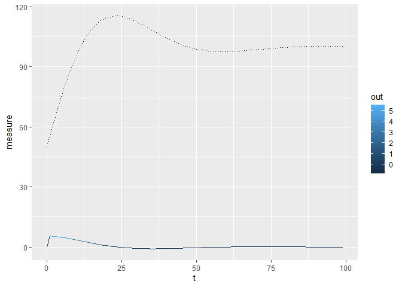
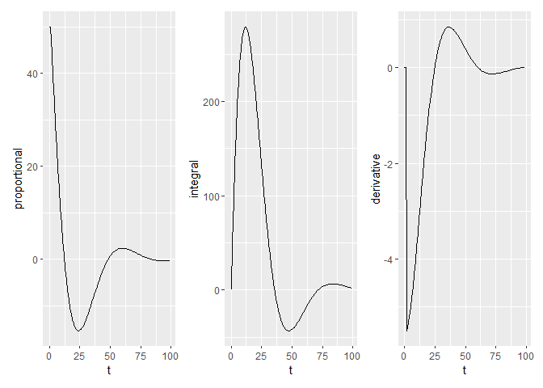

PID is a classic control mechanism. It controls an output based on
periodic measurements using the error term, its integral and its
derivative. The technique is a common, even *ubiquitous*, method for
real-world industrial analysis and control.

Mathematically, the control function $u(t)$ in terms of
control-measurement error $\epsilon$ amounts to:

$$
u(t)=K_p\epsilon(t)+K_i\int \epsilon(\tau)d\tau+K_d\frac{d\epsilon(t)}{dt}
$$

This article applies C++ as the core PID implementation with use of R as
the testing engine.

# C++ Implementation

See the core computation in the listing below.

``` cpp
    const scalar_type p = control_ - measure_;
    const scalar_type i = i_ + p;
    const scalar_type d = p - p_;
    out_ = kp_ * p + ki_ * i + kd_ * d;
    p_ = p;
    i_ = i;
```

The implementation uses trailing underscore to mark PID class members.
This helps to differentiate member variable access from stack or
register variable access. The computation benefits from this notation as
well; the trailing underscore matches the *prime* in $(p', i', d')$
whose values persist in volatile memory between computation cycles. The
output calculation derives from the current monotonic cycle’s
proportion, integral and derivative. The order of declarations reflects
an input-compute-output approach. The compiler may decide to rearrange
the order for optimisation purposes.

The `const` declarations are computationally redundant but semantically
useful. The initial statements load the core’s register set with the new
monotonic cycle’s $(p, i, d)$ triplet. The latest output value derives
from these. The fourth statement relies on operator precedence;
multiplication precedes addition. Finally, the cycle persists $(p', i')$
for the next monotonic cycle.

The PID derivative term deserves some comment. The output does not
divide by time despite its delta time denominator. The denominator
factors in the integral factor. Divide the factor by delta time. This
obviates a divide operation, an expensive machine operation in cycle
times. The integral factor pre-divides by $dt$.

## Full Class

The full `pid::controller` class listing appears below.

``` cpp
/*!
 * \file pid_controller.hpp
 * \copyright (c) 2024, Roy Ratcliffe, Northumberland, United Kingdom
 * SPDX-License-Identifier: MIT
 *
 * Permission is hereby granted, free of charge,  to any person obtaining a
 * copy  of  this  software  and    associated   documentation  files  (the
 * "Software"), to deal in  the   Software  without  restriction, including
 * without limitation the rights to  use,   copy,  modify,  merge, publish,
 * distribute, sublicense, and/or sell  copies  of   the  Software,  and to
 * permit persons to whom the Software is   furnished  to do so, subject to
 * the following conditions:
 *
 *     The above copyright notice and this permission notice shall be
 *     included in all copies or substantial portions of the Software.
 *
 * THE SOFTWARE IS PROVIDED "AS IS", WITHOUT  WARRANTY OF ANY KIND, EXPRESS
 * OR  IMPLIED,  INCLUDING  BUT  NOT   LIMITED    TO   THE   WARRANTIES  OF
 * MERCHANTABILITY, FITNESS FOR A PARTICULAR   PURPOSE AND NONINFRINGEMENT.
 * IN NO EVENT SHALL THE AUTHORS  OR   COPYRIGHT  HOLDERS BE LIABLE FOR ANY
 * CLAIM, DAMAGES OR OTHER LIABILITY,  WHETHER   IN  AN ACTION OF CONTRACT,
 * TORT OR OTHERWISE, ARISING FROM,  OUT  OF   OR  IN  CONNECTION  WITH THE
 * SOFTWARE OR THE USE OR OTHER DEALINGS IN THE SOFTWARE.
 */

#pragma once

#ifdef __cplusplus
namespace pid {
template <typename T, typename U = T> class controller {
public:
  typedef T scalar_type;
  typedef U factor_type;

  controller(factor_type kp, factor_type ki, factor_type kd)
      : kp_(kp), ki_(ki), kd_(kd),
        // proportional, integral and derivative terms
        p_(0), i_(0), d_(0),
        // control point, measure point, output of PID controller
        control_(0), measure_(0), out_(0) {}

  void set_measure(scalar_type measure) { measure_ = measure; }
  scalar_type measure() const { return measure_; }

  void set_control(scalar_type control) { control_ = control; }
  scalar_type control() const { return control_; }

  //! \brief Resets the controller.
  //! \details Resetting the PID controller restarts the proportional error as
  //! the difference between the new control and the existing measure. The
  //! integral and derivative reset to zero. Always reset after setting a new
  //! control.
  void reset() {
    p_ = control_ - measure_;
    i_ = 0;
    d_ = 0;
  }

  void monotonic() {
    const scalar_type p = control_ - measure_;
    const scalar_type i = i_ + p;
    const scalar_type d = p - p_;
    out_ = kp_ * p + ki_ * i + kd_ * d;
    p_ = p;
    i_ = i;
    d_ = d;
  }

  scalar_type out() const { return out_; }

  // general accessors

  void set_proportional_factor(factor_type kp) { kp_ = kp; }
  factor_type proportional_factor() const { return kp_; }
  scalar_type proportional() const { return p_; }

  void set_integral_factor(factor_type ki) { ki_ = ki; }
  factor_type integral_factor() const { return ki_; }
  scalar_type integral() const { return i_; }

  void set_derivative_factor(factor_type kd) { kd_ = kd; }
  factor_type derivative_factor() const { return kd_; }
  scalar_type derivative() const { return d_; }

private:
  factor_type kp_, ki_, kd_;
  scalar_type p_, i_, d_;
  scalar_type control_, measure_, out_;
};
} // namespace pid
#endif

struct pid_float_s {
  float kp_, ki_, kd_;
  float p_, i_, d_;
  float control_, measure_, out_;
};

/*!
 * \brief Applies Proportion, Integral and Derivative monotonically.
 * \details First, set up the control point. Feed in the measurement samples
 * while applying the monotonic method until the output matches the control. The
 * name implies that the control hardware runs it periodically at a real-time
 * fixed rate---neither faster nor slower. The application is real-time.
 */
static inline void pid_float_monotonic(struct pid_float_s *pid_float) {
  const float p = pid_float->control_ - pid_float->measure_;
  const float i = pid_float->i_ + p;
  const float d = p - pid_float->p_;
  pid_float->out_ = pid_float->kp_ * p + pid_float->ki_ * i + pid_float->kd_ * d;
  pid_float->p_ = p;
  pid_float->i_ = i;
  pid_float->d_ = d;
}
```

The C++ code defines two types: one for the scalars and another for the
factors. This allows for higher precision when computing the output. For
example, assuming that the platform supports both 32- and 64-bit
floating-point numbers, the application may choose to apply double
precision for the computation, but cast to single-precision floats for
the persistent scalar terms. Many embedded platforms will support only
32-bit single-precision floating-point arithmetic. The C++
implementation therefore defaults to factor precision matching scalar
precision.

The full implementation additionally persists the *derivative* term in
volatile memory. This is not strictly necessary. The derivative becomes
redundant once applied to the output. Its value may prove useful for
diagnostics.

# C++ with R Wrapper

Import the wrapper class for R as follows. R has a canny ability to
dynamically compile and run chunks of C++. It works well.

``` cpp
#include <Rcpp.h>

using namespace Rcpp;

#include "pid_controller.h"

typedef pid::controller<double> PIDController;

RCPP_MODULE(mod_pid) {
  class_<PIDController>("PIDController")
    .constructor<PIDController::scalar_type, PIDController::scalar_type, PIDController::scalar_type>()
    .property("measure", &PIDController::measure, &PIDController::set_measure)
    .property("control", &PIDController::control, &PIDController::set_control)
    .method("reset", &PIDController::reset)
    .method("monotonic", &PIDController::monotonic)
    .property("out", &PIDController::out)
    .property("proportional", &PIDController::proportional)
    .property("integral", &PIDController::integral)
    .property("derivative", &PIDController::derivative);
}
```

Sourcing the C++ compiles the code, building and loading a library. The
`Rcpp` library synthesises an S4 class.

``` r
require(Rcpp)
```

    Loading required package: Rcpp

``` r
# Compile and link the C++ code.
Rcpp::sourceCpp("pid_controller.cpp")

# Show the class wrapper.
PIDController
```

``` bg-warning
C++ class 'PIDController' <00000269b17e99e0>
Constructors:
    PIDController(double, double, double)

Fields: 
    double control
    double derivative [readonly]
    double integral [readonly]
    double measure
    double out [readonly]
    double proportional [readonly]

Methods: 
     void monotonic()  
           
     void reset()  
           
```

``` r
# Create a new PID controller instance.
# Examine its type and structure.
pid <- new(PIDController, 0.1, 0.01, 0.01)
typeof(pid)
```

``` bg-warning
[1] "S4"
```

``` r
str(pid)
```

``` bg-warning
Reference class 'Rcpp_PIDController' [package ".GlobalEnv"] with 6 fields
 $ control     : num 0
 $ derivative  : num 0
 $ integral    : num 0
 $ measure     : num 0
 $ out         : num 0
 $ proportional: num 0
 and 18 methods, of which 4 are  possibly relevant:
   finalize, initialize, monotonic, reset
```

# Testing

How does it work? First set up the control point. Feed in the
measurement samples while applying the `monotonic` method until the
output matches the control. The name implies that the control hardware
runs it periodically at a real-time fixed rate. No faster, no slower.
The application is *real-time*.

What does the simulation need for testing purposes? Effectively, the PID
controller is a generator function.

## PID Properties

You can access the names of the PID controller fields using the
following expression. It uses R’s “currying” pipe operator `|>` for
nested function-calling clarity.

``` r
PIDController$fields() |>
  names()
```

``` bg-warning
[1] "control"      "derivative"   "integral"     "measure"      "out"         
[6] "proportional"
```

The following expression answers a named numerical vector for a given
PID controller. It extracts all the PID controller fields using the
property accessors.

``` r
pid$control <- 10
PIDController$fields() |>
  names() |>
  vapply(\(x, y) y[[x]], numeric(1L), y = pid)
```

``` bg-warning
     control   derivative     integral      measure          out proportional 
          10            0            0            0            0            0 
```

## PID Generator for Simulation

The listing below defines a `pid_gen` function that wraps a PID
controller within a co-routine generator.

``` r
# Using R's co-routines.
require(coro)
```

    Loading required package: coro

``` r
#' Compiles a PID co-routine.
#' @param hysteresis Optional hysteresis function.
#' Its result becomes the next PID measurement.
pid_gen <- \(control, measure,
             kp = 0.1, ki = 0.01, kd = 0.05,
             hysteresis = \(pid) pid$measure + pid$out)
  coro::gen({
    pid <- new(PIDController, kp, ki, kd)
    pid$control <- control
    pid$measure <- measure
    pid$reset()
    repeat {
      PIDController$fields() |>
        names() |>
        vapply(\(x, y) y[[x]], numeric(1L), y = pid) |>
        coro::yield()
      pid$monotonic()
      pid$measure <- do.call(hysteresis, list(pid))
    }
  })

#' Bind generated rows.
#' Useful convenience function. Collects then applies data frame row binding.
rbind_gen <- \(...)
  coro::collect(...) |>
    do.call(what = rbind)
```

The default hysteresis function simply adds the output to the current
measure for the next monotonic cycle. This is a gross simplification. In
real life, in practice, the lag between output and measurable effect
carries additional hysteresis.

## Measure and Output

Use the generator simulation to plot measurements side-by-side with PID
controller output.

``` r
library(ggplot2)

df <- pid_gen(100, 50, ki = 0.01, kd = 0.01) |>
  rbind_gen(n = 100L)
df <- cbind(df, t = 1:nrow(df) - 1L)

ggplot(df, aes(x = t)) +
  geom_line(aes(y = measure), linetype = "dotted") +
  geom_line(aes(y = out, colour = out))
```



## Proportion, Integral, Derivative

Plot the $(p', i', d')$ terms retained by the PID controller in-between
computation cycles.

``` r
library(patchwork)

(ggplot(df, aes(t, proportional)) + geom_line()) +
  (ggplot(df, aes(t, integral)) + geom_line()) +
  (ggplot(df, aes(t, derivative)) + geom_line())
```



# Conclusions

Importantly, the PID output operation runs monotonically. Control and
measure events may trigger asynchronously and outside the same monotonic
process. This is important because the measurements may have a sampling
rate that differs from the output’s control rate. CAN-based signals have
such limitations. PID control operates statefully; its output at time
$t$ depends on not only the control and measurement signals but also the
previously latched measurements—hysteresis.

The output is **not** the measurement. Its dimensions are the same but
the interpretation may not directly add to the next measurement.
Interpret the output as a sign and magnitude applied to the output
mechanism to move the next measurement towards the control goal. For
example, the actual output could be valves that energise and move the
measurement indirectly. The sign tells the control logic which valves to
open. The magnitude informs the logic of how much energy to apply.

The integral term continuously accumulates. Depending on the
application, this may not prove to be ultimately desirable, although it
tends to zero by definition.
